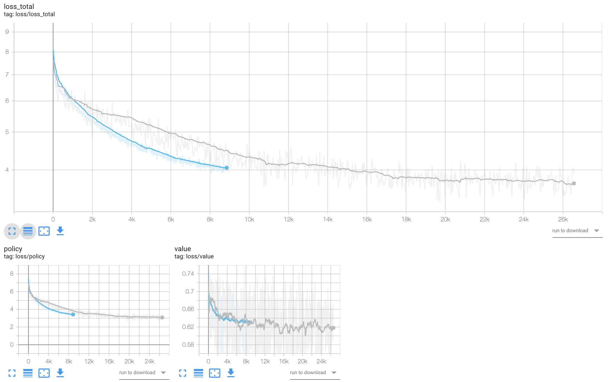

# Chess LM

Current neural chess engines like AlphaZero train a network based on self-play trajectories. Now that is a bit too much for me to handle alone and neither do I have the compute necessary. So it is possible to train a supervised model on millions of games and play against it.

Read [blog](https://yashbonde.github.io/blogs/chess-lm.html) for more information on the project.

### Data

To prepare your own data run the script `download.py` as follows:
```
# downloads the data from the list of links
python3 download.py -d # will take 20-30 mins depending on internet speed

# parses the data and starts storing information in text files
python3 download.py -p # will take few hours

Found 472 files.
Opening file: pgns/Sicilian2d6-4Qxd4.pgn: 100%|███████████████████| 472/472 [00:23<00:00, 20.20it/s]
Found 3167846 games, loaded 3166353 games (0.9995287018371474)
```

There are few improvements to be done if you are interested:

1. Introduce `multiprocessing` in the `download.py` to speed up the process, it was not needed in my case since I ran the code overnight on my laptop.
2. Speed up downloads by using `FTP` scripts instead of `HTTP` used by `requests` package.
3. Upload a neww version w/o the start and end tags

Or skip this entire part and download the ZIP using the following command:
```
wget --load-cookies /tmp/cookies.txt "https://docs.google.com/uc?export=download&confirm=$(wget --quiet --save-cookies /tmp/cookies.txt --keep-session-cookies --no-check-certificate 'https://docs.google.com/uc?export=download&id=1tdUgOB1VOnIT6opEJBzptp_rfUSEcbUZ' -O- | sed -rn 's/.*confirm=([0-9A-Za-z_]+).*/\1\n/p')&id=1tdUgOB1VOnIT6opEJBzptp_rfUSEcbUZ" -O agg.zip && rm -rf /tmp/cookies.txt
unzip agg.zip
```

This will download a zip file and extract to different files `agg_mv.txt` and `agg_res.txt` which are the moves file and results file respectively. (Read Credits for further clarification)

### Training

The if you have unzipped in same level as this repo then training is straightforward, run the command
```
python train.py --model=<model-name>
```

For baseline model I have following configurations:
```python
{
  "n_embd": 128,
  "n_head": 8,
  "n_inner": None,
  "n_layer": 30,
  "n_positions": 60,
  "beta1": 0.9,
  "beta2": 0.95,
  "lr": 0.0001,
}
```

I use 2x1080Ti configuration with 128 GB of RAM, `batch_size=350` seems to fill just about both the GPUs.

### Training Logs

|name|n_embd|n_layer|buffer_size|batch_size|
|-|-|-|-|-|
|v0|128|30|55555|350|
|v3|128|30|99999|350|
|v5|128|30|1000000|350|
|v6|256|20|1000000|256|
|v7|128|30|1000000|350|

Consider the loss graph below, grey one is `v0` and blue one is `v7`, you can see that larger buffer improves the training and also makes it smoother.



## Todo

This is the task list:
- [x] Fix moves vocabulary and retrain
- [ ] Perform Accuracy run on different models and log
- [ ] Convert `IterableDataset` to `Dataset`
- [ ] Integrate code with a web interface on [chessshhh](https://github.com/yashbonde/chessshhh)
- [ ] Add Simple MinMax Tree search
- [ ] Add more complicated search algorithm MCTS

## Credits

The code I have written is under MIT License, code used under its own licenses. I scraped the links from [pgnmentor.com](https://www.pgnmentor.com/files.html) and the games are by the players. I am not aware of the legality here, so if you have an problem, just raise an issue. For now I have uploaded the parsed ZIP file on my GDrive.
