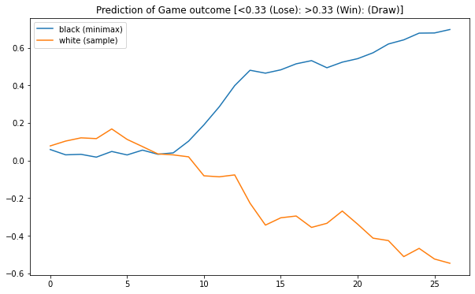
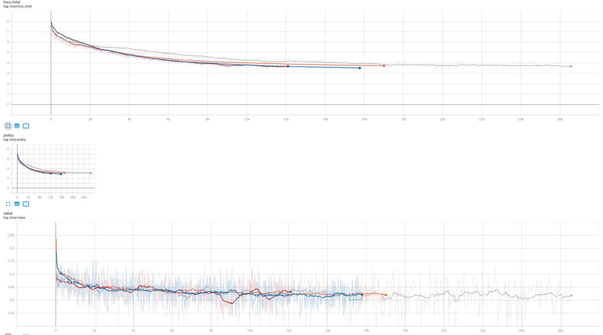

# Chess LM

Current neural chess engines like AlphaZero train a network based on self-play trajectories. Now that is a bit too much for me to handle alone and neither do I have the compute necessary. So it is possible to train a supervised model on millions of games and play against it.

Read [blog](https://yashbonde.github.io/blogs/chess-lm.html) for more information on the project.

<!-- I cannot believe that people do [such](https://arxiv.org/pdf/2008.04057.pdf) garbage work and can get
away with a paper. This is just sad man. -->

Now added is the code to server and a simple webapge to play in:
```
python3 play.py # goto http://0.0.0.0:5000/ in browser
```

To see a random gameplay between two AI agents ("AI goes brrrr....") run `python3 game.py` which will print value, confidence for each move and create a PGN file. To see the gameplay online goto this [website](https://chesstempo.com/pgn-viewer/), copy paste your PGN.


## It Learns!...?

Somehow there are signs that it is infact good at predicting the value of the board, if not at the policy.
Consider this simple game where two networks with the same weights were playing against one another. One used the minimax tree searching, while the other was using sampling.



Note that the game did not turn out to be like that, infact both the models play (policy) very stupidly. However they do correctly understand the state of the board and balck better than white because of that depth search. This used a `z5` model and 

## Todo

This is the task list:

- [x] **Perform Accuracy Tests:** Accuracy runs are not the correct measure of reliability of model as acurracy for low loss models is still close to 0. Created better metrics.
- [ ] Complete automation of tournament generation. Is there some way to define "whats going on?"
  - Add code for creating metric graphs.
- [ ] Integrate code with a web interface on [chessshhh](https://github.com/yashbonde/chessshhh)
  - Port code for server
    - There's this CORS for API and static file code is not being read correctly. Someone else has to fix those.
- Improvements to Tree search
  - Optimise code for deeper search. Add a timed buffer such that it.
  - Include upper confidence bound for better search
- [ ] (**later**) Add more complicated search algorithm MCTS


## Player

The way to evaluate the model is to make it into a player and run it. To make a player do the following:
```python
from game import GameEngine, Player

with open("assets/moves.json") as f:
    vocab_size = len(json.load(f))

# config for model
config = ModelConfig(vocab_size = vocab_size, n_positions=60, n_ctx=60, n_embd=128, n_layer=30, n_head=8)

# make two player
player1 = Player(config, ".model_sample/z4_0.pt", "assets/moves.json")
player2 = Player(config, ".model_sample/z4_0.pt", "assets/moves.json")

# define game engine
game = GameEngine()

# play
mv = 0
done = False
p = 0
while not done:
    # model returns move object, value, confidence of move
    if p == 0:
        m,v,c = player1.move(game)
        p += 1
    else:
        m,v,c = player2.move(game)
        p = 0
    done, res = game.step(m)
    print(m,v,c)
```

### Data

To prepare your own data run the script `download.py` as follows:

```
# downloads the data from the list of links
python3 download.py -d # will take 20-30 mins depending on internet speed

# parses the data and starts storing information in text files
python3 download.py -p # will take few hours

Found 472 files.
Opening file: pgns/Sicilian2d6-4Qxd4.pgn: 100%|███████████████████| 472/472 [00:23<00:00, 20.20it/s]
Found 3167846 games, loaded 3166353 games (0.9995287018371474)
```

Or skip this entire part and download the ZIP using the following command:

```
wget --load-cookies /tmp/cookies.txt "https://docs.google.com/uc?export=download&confirm=$(wget --quiet --save-cookies /tmp/cookies.txt --keep-session-cookies --no-check-certificate 'https://docs.google.com/uc?export=download&id=1tdUgOB1VOnIT6opEJBzptp_rfUSEcbUZ' -O- | sed -rn 's/.*confirm=([0-9A-Za-z_]+).*/\1\n/p')&id=1tdUgOB1VOnIT6opEJBzptp_rfUSEcbUZ" -O agg.zip && rm -rf /tmp/cookies.txt
unzip agg.zip
```

This will download a zip file and extract to different files `agg_mv.txt` and `agg_res.txt` which are the moves file and results file respectively. (Read Credits for further clarification)

### Training

The if you have unzipped in same level as this repo then training is straightforward, run the command
```
python train.py --model=<model-name>
```
I use 2x1080Ti configuration with 128 GB of RAM, `batch_size=350` seems to fill just about both the GPUs. Model `z5` has the baseline config.

### Training Logs

| name        | n_embd | n_layer | buffer_size | batch_size | maxlen |
| ------------| ------ | ------- | ----------- | ---------- | ------ |
| v0 (grey)   | 128    | 30      | 55555       | 350        | 60     |
| v6 (red)    | 256    | 20      | 1000000     | 256        | 60     |
| z5 (orange) | 128    | 30      | Full        | 350        | 60     |
| q1 (blue)   | 128    | 30      | Full        | 90         | 180    |

You can see that larger buffer improves the training as seen between `v0` and `v6`, both in overall loss and smoother loss curves. When compared with fully loaded dataset in `z5` the loss curve is more smoother while the training takes longer. It eventually does reach the lower loss value (epoch-end). Due to a bug in the `IterableDataset` number of samples was lower than fully loaded counterpart also seen is that a larger model gives only a slight edge over the smaller counterpart while parameters are ~3x.



These curves obey the neural language models scaling laws as proposed by OpenAI. Read more in this [blog](https://yashbonde.github.io/blogs/chess-lm-1_5.html). Moreover models trained on longer sequences only provides a bit better training (compare to `v6`).

## Metrics

How do we find out whether the model is learning or not. Often during the gameplay I see that it shows a certain smartness and ability to remember. Now after performing a first round of testing with minimax tree search (where `k = 1`), the model plays repeated moves. Consider this PGN, where the king repeatedly moves in the same pattern:
```
1. a3 Nf6 2. f4 e6 3. g4 d6 4. Bg2 Nfd7 5. c3 c6 6. b3 a6 7. Be4 g6 8. c4 b6 9. d3 Ra7 10. Nh3 Rc7 11. c5 Ra7 12. Bd5 g5 13. Bg2 Ra8 14. Ng1 Ra7 15. Nh3 Ke7 16. Be4 Ke8 17. Bxh7 d5 18. Bb2 Bd6 19. a4 Kf8 20. Bxh8 gxf4 21. Qc1 Ke8 22. b4 f5 23. Qc4 Kf8 24. Kf2 Ke8 25. cxd6 Kf8 26. Rc1 Ke8 27. Nd2 Kf8 28. Ng1 Ke8 29. h4 Kf8 30. d4 Ke8 31. e4 Kf8 32. Rab1 Ke8 33. h5 Kf8 34. exf5 Ke8 35. Qd3 Kf8 36. Rc3 Ke8 37. fxe6 Kf8 38. Nc4 Ke8 39. h6 Kf8 40. Nh3 Ke8 41. Rcc1 Kf8 42. Ng1 Ke8 43. Qg6+ Kf8 44. Nd2 Qe8 45. Kf3 Qd8 46. Rc2 Qe8 47. Qg8# *
```

I need to come up with good metrics!

## Updates

- **30/12/2020** As I had new learnings, there were something that needed deprecation and improvements:
  - No longer supporting IterativeDatasets, full work much better
  - Bring back train/holdout sets to be generated from same function
  - Improve logging in tensorboard, now logs move accuracy, train and evaluation have same logs for consistency
  - Testing now happens as the training progresses and not after an epoch (re wrote `Trainer.train()` method for this)
  - `total_steps` is now the default iteration method and not `max_epochs`, determined using `total_step = num_batch * max_epochs` and add early stopping. This brings is closer to the literature where training is done over a fixed set of steps and valuation also happens on steps and not epochs.

## Credits

The code I have written is under MIT License, code used under its own licenses. I scraped the links from [pgnmentor.com](https://www.pgnmentor.com/files.html) and the games are by the players. I am not aware of the legality here, so if you have an problem, just raise an issue. For now I have uploaded the parsed ZIP file on my GDrive.