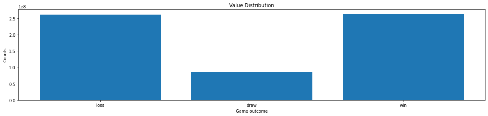
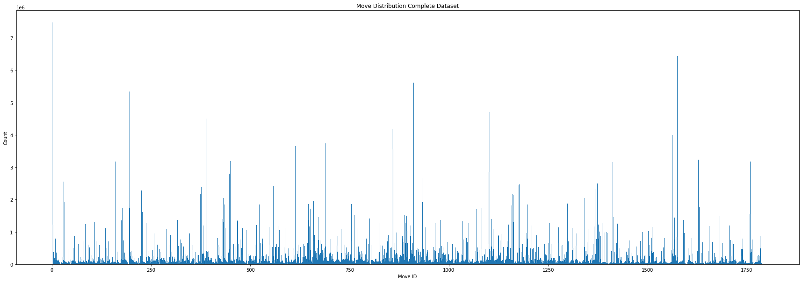

# Chess LM

Current neural chess engines like AlphaZero train a network based on self-play trajectories. Now that is a bit too much for me to handle alone and neither do I have the compute necessary. So it is possible to train a supervised model on millions of games and play against it.

Read [blog](https://yashbonde.github.io/blogs/chess-lm.html) for more information on the project or watch me [stream](https://www.youtube.com/playlist?list=PLDwlXbwbl9GN4byp44SmqzrRGwHNbUqg3).

<!-- I cannot believe that people do [such](https://arxiv.org/pdf/2008.04057.pdf) garbage work and can get
away with a paper. This is just sad man. -->

Now added is the code to server and a simple webapge to play in:
```
python3 play.py # goto http://0.0.0.0:5000/ in browser and play
```

To see a random gameplay between two AI agents ("AI goes brrrr....") run `python3 game.py` which will print value, confidence for each move and create a PGN file. To see the gameplay online goto this [website](https://chesstempo.com/pgn-viewer/), copy paste your PGN.

**In order to train a network that does not collapse and is able to reduce the MSE valaue error the longer sequence lengths actually help!**

**Bonus:** Supervised results are 100% reproducible ensure that you use the same values as logged. If you consider loss as the AlphaZero where it was scaled by 1/4 to keep in [0,1] I do get the same values, the only task is to improve the policy:


## It Learns!...?

Somehow there are signs that it is infact good at predicting the value of the board, if not at the policy.
Consider this simple game where two networks with the same weights were playing against one another. One used the minimax tree searching, while the other was using sampling.


Note that the game did not turn out to be like that, infact both the models play (policy) very stupidly. However they do correctly understand the state of the board and balck better than white because of that depth search. This used a `z5` model (old).

## Todo

This is the task list:

- Cloud run for self play data collection
  - Build a distributed system for data collection, the sequential method takes a lot of time
  - Is is possible to build multiple servers for self play and some for training
  - Is it possible to parallelize the process to use each GPU to it's maximum efficiency

## Player

The way to evaluate the model is to make it into a player and run it. To make a player do the following:
```python
from game import GameEngine, Player

with open("assets/moves.json") as f:
    vocab_size = len(json.load(f))

# config for model
config = ModelConfig(vocab_size = vocab_size, n_positions=60, n_ctx=60, n_embd=128, n_layer=30, n_head=8)

# make two player
player1 = Player(config, ".model_sample/z4_0.pt", "assets/moves.json")
player2 = Player(config, ".model_sample/z4_0.pt", "assets/moves.json")

# define game engine
game = GameEngine()

# play
mv = 0
done = False
p = 0
while not done:
    # model returns move object, value, confidence of move
    if p == 0:
        m,v,c = player1.move(game)
        p += 1
    else:
        m,v,c = player2.move(game)
        p = 0
    done, res = game.step(m)
    print(m,v,c)
```

## Data

There are two sources for all the games [links.txt](./assets/links.txt) which has pgnmentor files and **ALL** games from FICS and second [links2000.txt](./assets/links2000.txt) which has all the games where average ELO > 2000 from FICS datasets. I am using the second file now and use 5% testing split. To prepare your own data run the script `download.py` as follows (**You will always have to create new links**):
```bash
# Following timings are given for my system with `Xeon® E5-2620 v3` (24 cores)

# downloads the data from the list of links
python3 download.py -d # takes ~4mins to download and unzip

# parses the data and starts storing information in text files
python3 download.py -p # at 20 workers, parsing completed in 01:09:08

# now create the test and training files
python3 download.py -m 0.05 # couple of minutes
# Total Games: 7477392
# Total Moves: 620683696
# Test Size:   373869

# compile the dataset
python download.py -c 85 npz
# maxlen = 85 and store to *.npz file allows you to have arbitrary test and train sizes
```

**DEPRECATED:** This dataset is no longer used for training, the ZIP while will be available for a while but may be removed without warning.Download the ZIP using the following command:

```
wget --load-cookies /tmp/cookies.txt "https://docs.google.com/uc?export=download&confirm=$(wget --quiet --save-cookies /tmp/cookies.txt --keep-session-cookies --no-check-certificate 'https://docs.google.com/uc?export=download&id=1tdUgOB1VOnIT6opEJBzptp_rfUSEcbUZ' -O- | sed -rn 's/.*confirm=([0-9A-Za-z_]+).*/\1\n/p')&id=1tdUgOB1VOnIT6opEJBzptp_rfUSEcbUZ" -O agg.zip && rm -rf /tmp/cookies.txt
unzip agg.zip
```

This will download a zip file and extract to different files `agg_mv.txt` and `agg_res.txt` which are the moves file and results file respectively. (Read Credits for further clarification)

#### Data Distribution

In the FICS games dataset we get the following distributions:




Get the complete moves distributions in this [file](assest/../assets/dist.txt).

### Self Play Data

Self play is done to collect more data than available and use the updated models to keep increasing the quality of training data. Once you have atleast one model ready you can start to use that to create a dataset. The pipeline is designed to pickle the buffer, .tar.gz zip it and upload to AWS. Now for your usecase you will have to update the script `generate_selfplay_data.py`. If you do not want to upload the data just want to test the script add LOCAL=1 environment variable:
```
$ python3 generate_selfplay_data.py --best_model_path models/useful/winter-sweep-5/cgpt_27000.pt
$ LOCAL=1 python3 generate_selfplay_data.py --best_model_path models/useful/winter-sweep-5/cgpt_27000.pt
```

## Training

The if you have unzipped in same level as this repo then training is straightforward, run the command
```
python train.py --model=<model-name>
```

<details>
  <summary>Older Logs</summary>

  ### Training Log (Old)
  
  I use 2x1080Ti configuration with 128 GB of RAM, `batch_size=350` seems to fill just about both the GPUs. Model `z5` has the baseline config.

  | name        | n_embd | n_layer | buffer_size | batch_size | maxlen |
  | ------------| ------ | ------- | ----------- | ---------- | ------ |
  | v0 (grey)   | 128    | 30      | 55555       | 350        | 60     |
  | v6 (red)    | 256    | 20      | 1000000     | 256        | 60     |
  | z5 (orange) | 128    | 30      | Full        | 350        | 60     |
  | q1 (blue)   | 128    | 30      | Full        | 90         | 180    |

  You can see that larger buffer improves the training as seen between `v0` and `v6`, both in overall loss and smoother loss curves. When compared with fully loaded dataset in `z5` the loss curve is more smoother while the training takes longer. It eventually does reach the lower loss value (epoch-end). Due to a bug in the `IterableDataset` number of samples was lower than fully loaded counterpart also seen is that a larger model gives only a slight edge over the smaller counterpart while parameters are ~3x.

  

  These curves obey the neural language models scaling laws as proposed by OpenAI. Read more in this [blog](https://yashbonde.github.io/blogs/chess-lm-1_5.html). Moreover models trained on longer sequences only provides a bit better training (compare to `v6`).
</details>


### Training Logs

This is the new training logs on a variety of machines (2x2080Ti). With the new datasets we have `620683696` moves and `7477392` games giving `83` moves per turn, considering this, the new models will be trained with a sequence length of `85`, lowering the compute required and faster training. I have now started using weights and biases see all the details on the [project page](https://wandb.ai/yashbonde/blindfold-chess), current best model is `devoted-glade-16`.

The problem lies in the model learning where `loss_value` eventually settles at 0.85 which means that the values and predictions collapse to 0 as below:
```
zs = np.zeros((res.shape[0] * res.shape[1]))
loss_z = np.mean((zs - res.reshape(-1)) ** 2)
loss_z # 0.8581690492029814
```

Lessons:
- Which means during the training we can try with ignoring the weight decay and improving the learning rate.
- Larger learning rate have no significant advantage

## Metrics

How do we find out whether the model is learning or not. Often during the gameplay I see that it shows a certain smartness and ability to remember. Now after performing a first round of testing with minimax tree search (where `k = 1`), the model plays repeated moves. Consider this PGN, where the king repeatedly moves in the same pattern:
```
1. a3 Nf6 2. f4 e6 3. g4 d6 4. Bg2 Nfd7 5. c3 c6 6. b3 a6 7. Be4 g6 8. c4 b6 9. d3 Ra7 10. Nh3 Rc7 11. c5 Ra7 12. Bd5 g5 13. Bg2 Ra8 14. Ng1 Ra7 15. Nh3 Ke7 16. Be4 Ke8 17. Bxh7 d5 18. Bb2 Bd6 19. a4 Kf8 20. Bxh8 gxf4 21. Qc1 Ke8 22. b4 f5 23. Qc4 Kf8 24. Kf2 Ke8 25. cxd6 Kf8 26. Rc1 Ke8 27. Nd2 Kf8 28. Ng1 Ke8 29. h4 Kf8 30. d4 Ke8 31. e4 Kf8 32. Rab1 Ke8 33. h5 Kf8 34. exf5 Ke8 35. Qd3 Kf8 36. Rc3 Ke8 37. fxe6 Kf8 38. Nc4 Ke8 39. h6 Kf8 40. Nh3 Ke8 41. Rcc1 Kf8 42. Ng1 Ke8 43. Qg6+ Kf8 44. Nd2 Qe8 45. Kf3 Qd8 46. Rc2 Qe8 47. Qg8# *
```

I need to come up with good metrics!

## Updates

- **29/12/2020** Some more updates:
  - Self play pipeline for pickling-zipping-uploading complete. Read instruction for run above.

- **25/12/2020** Some more updates:
  - Trained a massive 100-model zoo using Weights & Biases Sweep functionality. Models now regularly hit as low as 0.73 on value loss.
  - minimum `total_loss` is 3.365 for model `cool-sweep-29`. Check W&B [here](https://wandb.ai/yashbonde/blindfold-chess)
  - Best config till now has `--weight_decay=0.2606929941219779 --warmup_perc=0.21570177919850358 --lr=0.0008460163368533219 --batch_size=93` but was trained for only one epoch. I will trian another model but for longer epoch and see if there any benefits.
  - Start building self-play data collection pipeline store zipped self-play dumps on AWS
  - Include GPT-3 style LR scheduler

- **13/12/2020** Some more updates:
  - After training 99 networks I havae realised that longer sequences train better networks.
  - self-play code started, can fill a buffer

- **05/12/2020** Some more updates:
  - New, better, larger dataset form FICS website
  - Updated `download.py` to now use multiprocessing for faster dataset preparation
  - Move to 2x2080Ti machine and start with new models
  - Compile datasets in HDF5 or numpy zips
  - Implment multiple different learning rate schedulers, best still is linear-warmup with exponential decay. Supports "CosineAnnealingWarmRestarts", "OneCycleLR", "MultiStepLR", "NoamDecay", "CosineDecay"
  - Implement weight decay
  - Move Training logs to W&B (god bless this!)
  - Reformulate my network to current RL standard, not my standard. Also change code according to it.

- **30/11/2020** As I had new learnings, there were something that needed deprecation and improvements:
  - No longer supporting IterativeDatasets, full work much better
  - Bring back train/holdout sets to be generated from same function
  - Improve logging in tensorboard, now logs move accuracy, train and evaluation have same logs for consistency
  - Testing now happens as the training progresses and not after an epoch (re wrote `Trainer.train()` method for this)
  - `total_steps` is now the default iteration method and not `max_epochs`, determined using `total_step = num_batch * max_epochs` and add early stopping. This brings is closer to the literature where training is done over a fixed set of steps and valuation also happens on steps and not epochs.


## Credits

The code I have written is under MIT License, code used under its own licenses. I scraped the links from [pgnmentor.com](https://www.pgnmentor.com/files.html) and [ficsgames.org](https://www.ficsgames.org/download.html) and the games are by the players. I am not aware of the legality here, so if you have an problem, just raise an issue. For now I have uploaded the parsed ZIP file on my GDrive.